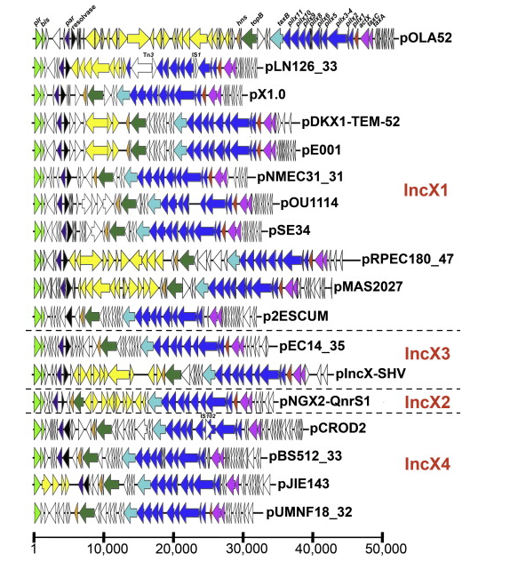
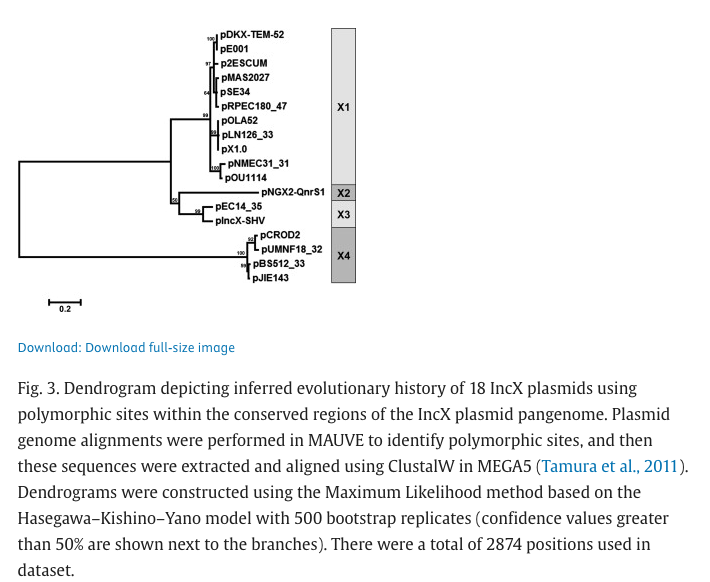
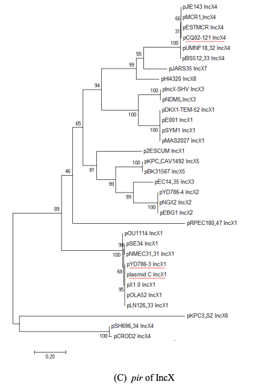
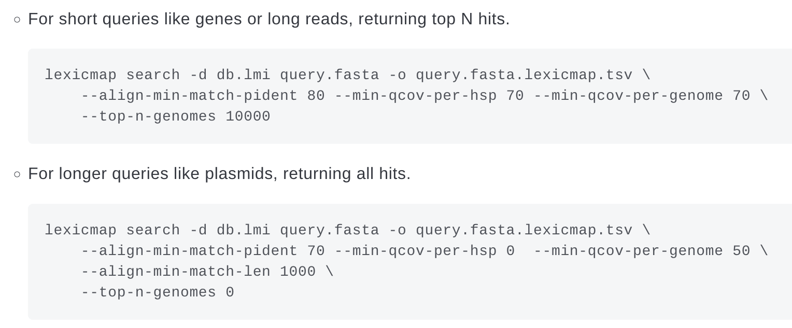
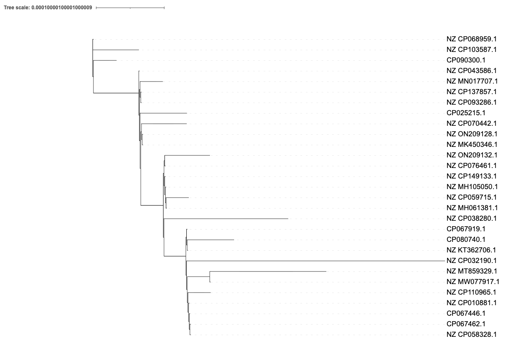
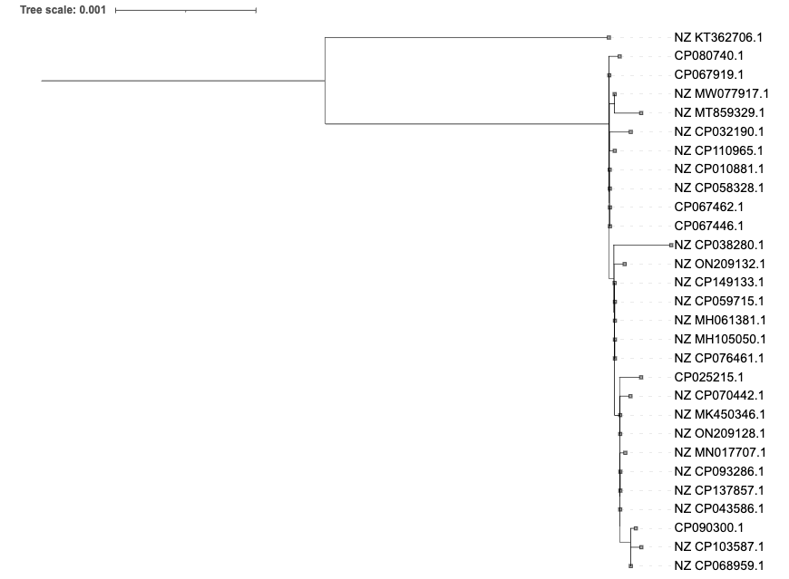
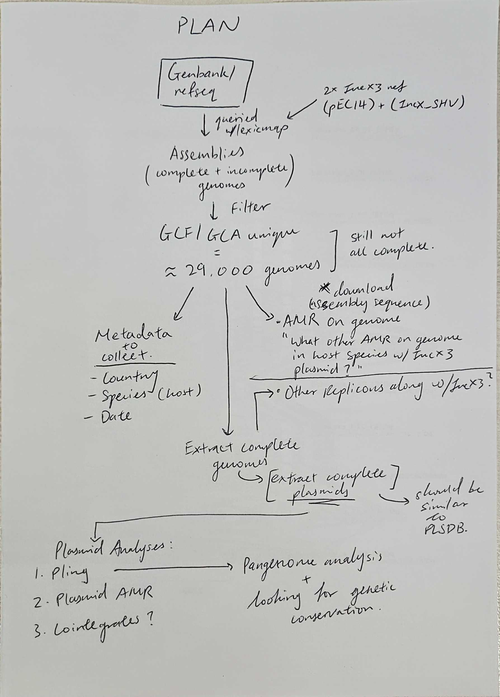

## **260915**  
1. Comparing both IncX3 references from PLSDB to understand their differences - they are the *pir* genes of the IncX3 plasmids
- Theres a paper that compares them both    


First isolated IncX3 in E.coli = pEC14_35 in USA in 1989    
Used polymorphic sites in backbone to determine IncX3 subtype which included both plasmids


There is a divergent split in IncX3 pir genes where at the nucleotide level they are very different but still under the same Inc-type. So plasmidfinder keeps both pir gene types as references.  


Replicon typing uses the replication machinery to type plasmids but in the case of IncX3, there are divergent pir genes that belongs to the same plasmid replicon type - IncX3 by work examining polymorphic sites on IncX plasmid backbone

## <mark> Results </mark>

JN247852 = pIncX-SHV    
JN935899 = pEC14_35

---
2. Lexicmap query using both references and set the parameters for hits and understand what number of hits do I want for each plasmid.
> What does it mean by getting one hit per reference
- only one copy of the pir gene per isolate = one IncX3 backbone per isolate -> YES 
- Cant get more than one hit per isolate? - try?

> Parameters?
- Querying for part of the pir gene not the whole replicton but can do the whole replicon instead? (wondering which will be better?)
    - Try both using the parameters recommended by lexicmap:



## **260916**
1. Running lexicmap with gene parameters for the plasmidfinder refs (pir gene) on ATB
    - No isolate sharing both pir queries
    - 8 isolates have 2 hits for pIncX-SHV

2. Running lexicmap with whole plasmids of the plasmidfinder refs (pEC14 + pIncX_SHV) on ATB
    - 

3. Running lexicmap with gene parameters for the plasmidfinder refs (pir gene) on Refseq
    - There is one isolate that hit both pir gene ref (GCA_041400345.1)


## **260917**
1. Indexing PLSDB 
2. Then running lexicmap on it
3. Filtered results by unique accession and by 90% qcov
4. Find how many hits for each ref there are at 90% at unique accessions

## **260918**
1. Read up on panaroo
2. Run pilot panaroo on one of the extracted database accessions top ~ 20 -30?
    - Chose PLSDB for its better assembly quality (curated)
    - Taking the hits for just one of the IncX3 refs (pIncX-SHV as pEC14 only has 4 hits)
    - Taking the first 30 on the list. 
    - Extracted the fasta from NCBI with Edirect (efetch)
    - Split them up into individual fasta files (good for future use)
    - Annotating them with bakta with the `--complete` flag as PLSDB was the chosen database
    - Ran panaroo with strict mode and with alignment

## **260922**
1. Understand panaroo results
    - View alignment tree on IQtree

        - Currently using the default model which might be a fixed model, is unrooted and has no bootstrap/support values (bootstrap = replicates of running the tree model)
    - Gene presence/absence - phandango?

## **260923**
1. Understanding what to run panaroo on to get a better alignment tree from the multi-sequence alignment (MSA)
    - Change model? -> Clustal
    - on strict mode with alignment to pangenome not just core with a core threshold of 98%
2. Re-run panaroo on the parameters above
3. Investigate iqtree and include bootstrapping
    - rooted the tree to midpoint on iTOL


> Thoughts:     
> - Seem pretty good; want to maybe look at consolidating the my database now so I can do the tree for it. 

4. Decided to try and get all biosample accessions for all lexicmap queried data
    - Tried it out small scale with ichsm on the plsdb pilot set (n=29)

```bash
'while read -r f; do ichsm search -a ${f} -c sample_accession >> ichsm_results.txt; done < ../plsdb_pilot_list_ichsm.tsv'
```
*Searched for column sample_accession*      
- `ichsm get_fields` shows ENA result types and whether ichsm search supports them      

Some of the 29 did not return a sample accession?

---
---

## **260924**
1. Pull out all refseq accessions from the lexicmap query unique90 and compare with hits gotten from plsdb
OR
Dedup the unique90 list of refseq genbank with just an accession number without the GCA/GCF and .1 then using ichsm find if the assembly is complete and only take the ones that are complete

## **260927**
1. Above's 1. 
    - Pulled out all refseq accessions from the query of refseq genbank list (unique) + (unique90)
        - 8215 (unique)
        - 7113 (unique90)
        - 964 (PLSDB)
    - Seems like it doesn't match up - dedup with accession number
    - Dedup the unique list not the unique90 list for refseqgenabnk
        - Kept the GCF accession when deduplicating

2. Created big spreadsheet for keeping track of everything

3. Now need to cross-check deduplicating with the PLSDB list
    - Use ichsm to find bioproject accession and dedup between refseq and PLSDB
    - Having some issues - PLSDB have a lot of them having no biosample attached
    - Maybe can dedup based on nucleotide accession?


## **261006**
1. Continue working on the deduplication of plsdb with refseq
    - Working on the script so I can just plug and play
    - Doing it with plsdb at the moment
    - Got script to run - want to append the ichsm query of assembly completeness as well.
        - maybe append after deduplication is done
2. Have to then check for completeness - investigate ichsm as it seems to have that option to look at completeness 
    - ichsm has the option for completeness score if its there
    - Can look for completeness through assembly_level as well but have to use the assembly_accession as the input


## **261007**
1. Re-established plan
2. Using new plan 
    - Not deduplicating ATB anymore (not using it for now at least)
    - No need to get complete genomes to grep metadata
3. Taking the big txt file from genbank refseq (given by Leah) to grep for metadata from the GCF/GCA filtered list
    - Use csvtk?
4. Read the PLSDB paper to see how they went about extracting the complete plasmids from the assemblies on genbank refseq


