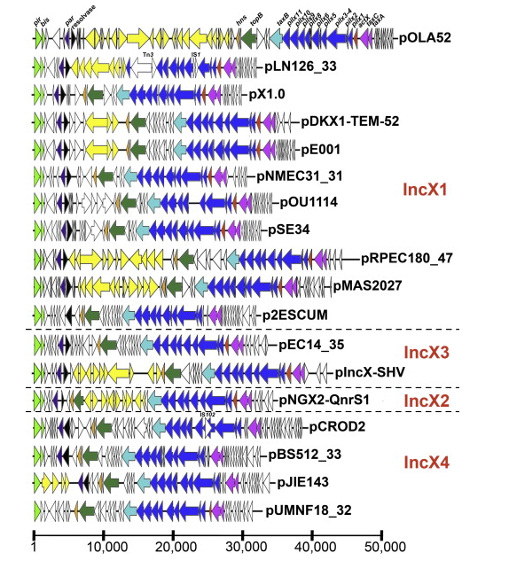
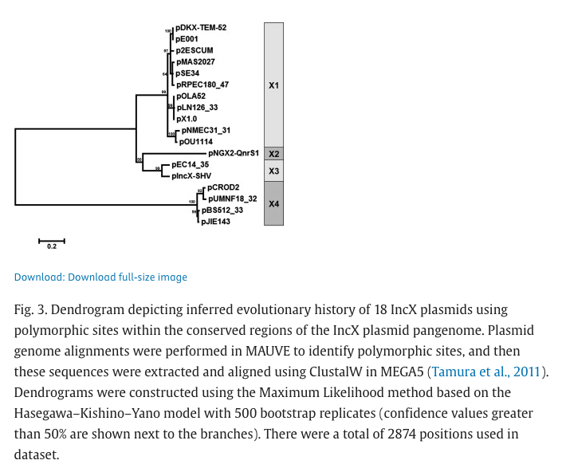
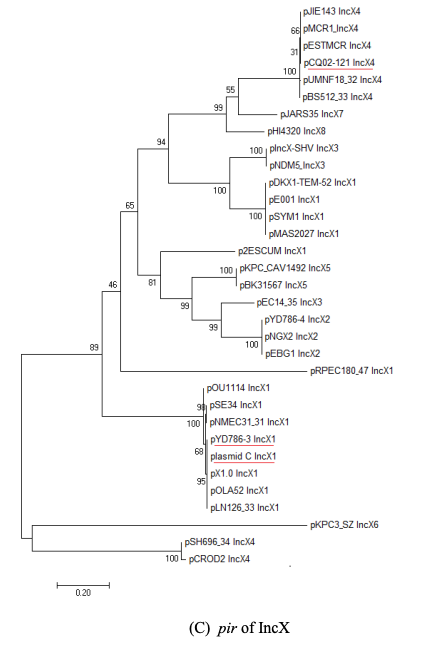
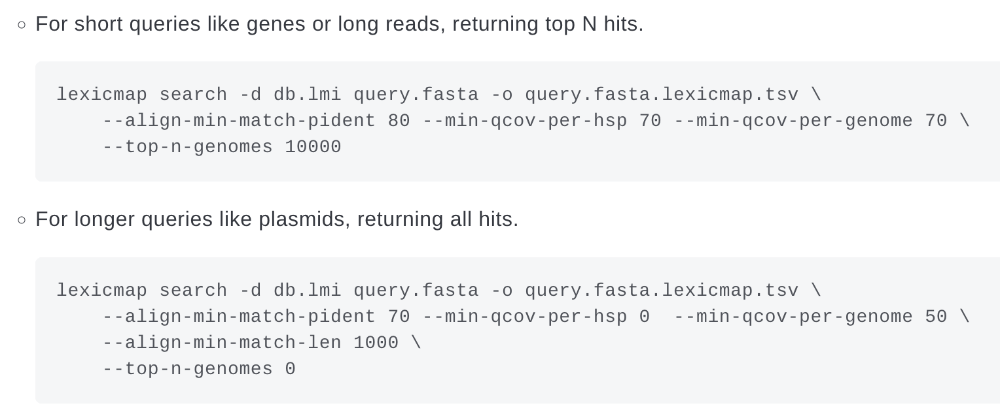

## **260915**  
1. Comparing both IncX3 references from PLSDB to understand their differences - they are the *pir* genes of the IncX3 plasmids
- Theres a paper that compares them both    

First isolated IncX3 in E.coli = pEC14_35 in USA in 1989    
Used polymorphic sites in backbone to determine IncX3 subtype which included both plasmids

There is a divergent split in IncX3 pir genes where at the nucleotide level they are very different but still under the same Inc-type. So plasmidfinder keeps both pir gene types as references.  

Replicon typing uses the replication machinery to type plasmids but in the case of IncX3, there are divergent pir genes that belongs to the same plasmid replicon type - IncX3 by work examining polymorphic sites on IncX plasmid backbone

## <mark> Results </mark>

JN247852 = pIncX-SHV    
JN935899 = pEC14_35

---
2. Lexicmap query using both references and set the parameters for hits and understand what number of hits do I want for each plasmid.
> What does it mean by getting one hit per reference
- only one copy of the pir gene per isolate = one IncX3 backbone per isolate -> YES 
- Cant get more than one hit per isolate? - try?

> Parameters?
- Querying for part of the pir gene not the whole replicton but can do the whole replicon instead? (wondering which will be better?)
    - Try both using the parameters recommended by lexicmap:

## **260916**
1. Running lexicmap with gene parameters for the plasmidfinder refs (pir gene) on ATB
    - No isolate sharing both pir queries
    - 8 isolates have 2 hits for pIncX-SHV

2. Running lexicmap with whole plasmids of the plasmidfinder refs (pEC14 + pIncX_SHV) on ATB
    - 

3. Running lexicmap with gene parameters for the plasmidfinder refs (pir gene) on Refseq
    - There is one isolate that hit both pir gene ref (GCA_041400345.1)

## **260917**
1. Indexing PLSDB 
2. Then running lexicmap on it
3. Filtered results by unique accession and by 90% qcov
4. Find how many hits for each ref there are at 90% at unique accessions

## **260918**
1. Read up on panaroo
2. Run pilot panaroo on one of the extracted database accessions top ~ 20 -30?
    - Chose PLSDB for its better assembly quality (curated)
    - Taking the hits for just one of the IncX3 refs (pIncX-SHV as pEC14 only has 4 hits)
    - Taking the first 30 on the list. 
    - Extracted the fasta from NCBI with Edirect (efetch)
    - Split them up into individual fasta files (good for future use)
    - Annotating them with bakta with the `--complete` flag as PLSDB was the chosen database
    - Ran panaroo with strict mode and with alignment

